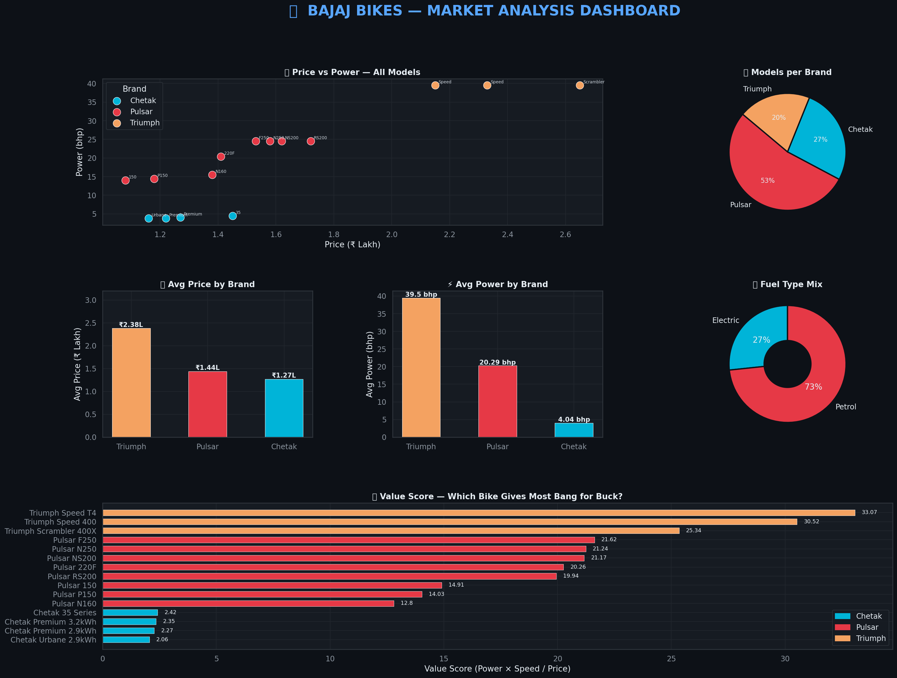
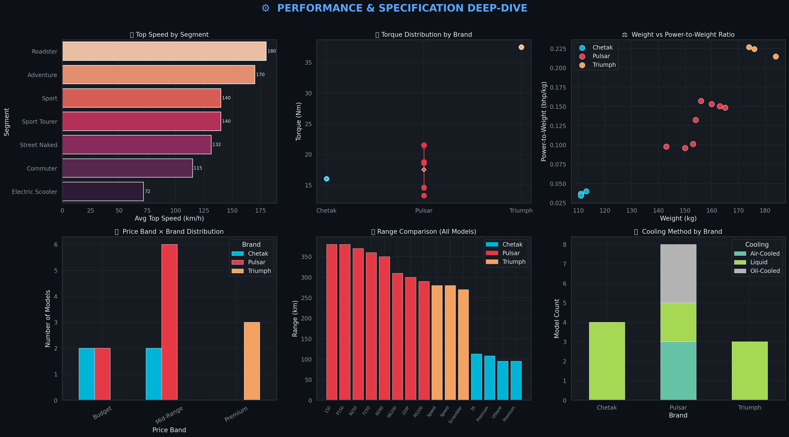
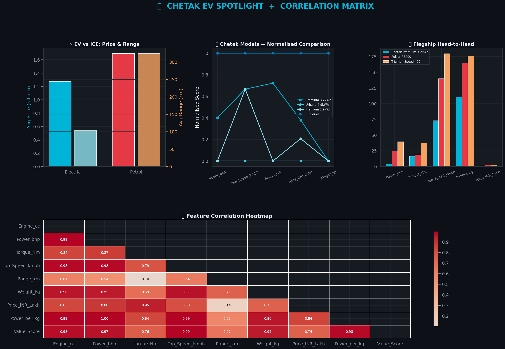

# 🏍️ Bajaj Bikes Market Analysis

## Overview

This project is a data analysis of Bajaj’s three major brands — **Chetak EV, Pulsar, and Triumph (Bajaj collaboration)**.

The goal was to understand how these bikes compare in terms of **price, performance, and overall value**, using real-world data and visualizations.

---

## What I Did

* Collected and cleaned data for 15 bike models
* Created new metrics like **power-to-weight ratio** and **value score**
* Stored and analyzed data using **SQLite**
* Built multiple dashboards to compare different aspects
* Derived insights from trends and correlations

---

## Tech Stack

* Python (Pandas, NumPy)
* Matplotlib & Seaborn
* SQLite
* VS Code / Jupyter

---

## Key Insights

* Triumph bikes are significantly more expensive than Pulsar
* Pulsar NS200 stands out as a strong value-for-money option
* Chetak EV offers decent range (up to 113 km), but still lags behind petrol bikes
* Price and power are closely related

---

## Dashboards

### Market Overview



### Performance Analysis



### EV & Correlation Analysis



---

## Project Structure

```
data/         → dataset and database  
dashboards/   → charts and visual outputs  
src/          → main Python script  
insights/     → written observations  
```

---

## How to Run

```
pip install -r requirements.txt
python src/bajaj_analysis.py
```

---

## About Me

Aniketh Ghanwar
B.Tech CSE (Data Science)
Guru Nanak Institute of Technical Campus

---

This project was done as part of an internship exercise to apply data science concepts to a real-world scenario.
